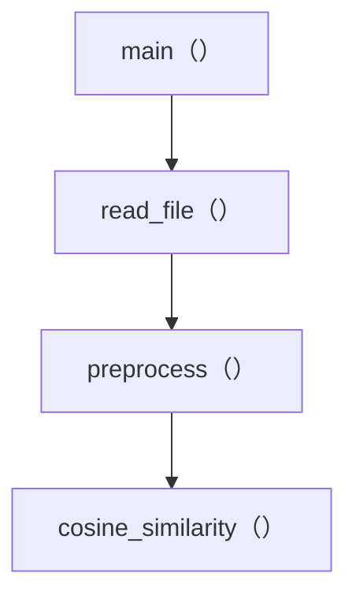
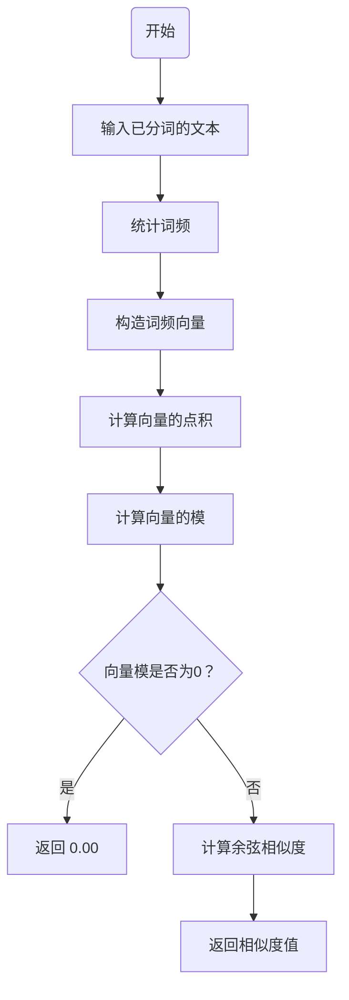

| 这个作业属于哪个课程 |https://edu.cnblogs.com/campus/gdgy/CSGrade22-34|
| ----------------- |--------------- |
| 这个作业要求在哪里| https://edu.cnblogs.com/campus/gdgy/CSGrade22-34/homework/13229|
| 这个作业的目标 | 1.熟悉软件开发流程<br />2. 提高代码编程能力<br />3. 掌握代码质量分析、性能分析的方法<br />4. 掌握项目单元测试的方法<br />5. 了解测试覆盖率 |

[Github链接](https://github.com/LiChao258932589/LiChao258932589/tree/main/3122004484)

# 一、PSP表格

| PSP2.1                        | Personal Software Process Stages | 预估耗时（分钟） | 实际耗时（分钟） |
| --------------------------------------- | ------------------------------------------ | -------------------------- | -------------------------- |
| Planning                                | 计划                                       | 30 | 35 |
|  ·  Estimate                              | · 估计这个任务需要多少时间                 | 30 | 35 |
| Development                             | 开发                                       | 420 | 450 |
| · Analysis                              | · 需求分析 (包括学习新技术)                | 60 | 70 |
| · Design Spec                           | · 生成设计文档                             | 60 | 65 |
| · Design Review                         | · 设计复审                                 | 30 | 25 |
| · Coding Standard                       | · 代码规范 (为目前的开发制定合适的规范)    | 30 | 25 |
| · Design                                | · 具体设计                                 | 60 | 65 |
| · Coding                                | · 具体编码                                 | 120 | 140 |
| · Code Review                           | · 代码复审                                 | 30 | 25 |
| · Test                                  | · 测试（自我测试，修改代码，提交修改）     | 30 | 35 |
| Reporting                               | 报告                                       | 60 | 55 |
| · Test Repor                            | · 测试报告                                 | 30 | 25 |
| · Size Measurement                      | · 计算工作量                               | 10 | 5 |
| · Postmortem & Process Improvement Plan | · 事后总结, 并提出过程改进计划             | 20 | 25 |
|                                         | · 合计                                     | 510 | 540 |

# 二、模块接口的设计和实现过程
## 1. 代码组织方式
代码以模块化的方式设计，共有以下几个关键模块
1. 文件读取模块：负责读取文本文件的内容。
2. 文本预处理模块：对原始文本进行分词和清洗，去除标点符号、换行符和多余的空格。
3. 相似度计算模块：使用余弦相似度算法，基于分词后的文本进行相似度计算。
4. 结果输出模块：将计算结果输出到指定文件。
## 函数设计说明
1. read_file(file_path)：读取文件内容并处理可能的异常情况。确保即使在各种错误（如文件不存在、权限问题）下，也能进行报错，防止程序崩溃。
2. preprocess(text)：进行文本的清洗和分词。使用正则表达式去除文本中的标点符号、换行符和多余的空格；使用 jieba 库进行分词。选择“精确模式”，以获取最贴合语义的分词结果。
3. cosine_similarity(text1, text2)：计算两个文本的余弦相似度。首先统计两个文本的词频，构造词频向量，最后基于词频向量计算余弦相似度。
## 2. 函数之间的关系
下面是函数之间的关系图

## 3. 关键函数的流程图

## 4. 程序算法的关键以及独到之处

# 三、模块接口部分的性能改进
## 1. Code Quality Analysis
本文使用的是Pycharm内置的代码检查和静态分析工具
+ 检查结果

## 2. 性能分析
本文使用的是line_profiler来进行性能分析。line_profiler是Python的一个第三方库，其功能时基于函数的逐行代码分析工具，通过该库，可以对目标函数(允许分析多个函数)进行时间消耗分析。
+ 分析结果
  + read_file()函数
  
  + preprocess()函数
  
  + cosine_similarity()函数
  
  + main()函数
  
+ 分析结论
  + 程序中时间消耗最大的函数式main()函数，代码如下：
```python
def main():
    # 从命令行获取参数
    if len(sys.argv) != 4:
        print("用法: python plagiarism_check.py <原文文件路径> <抄袭版文件路径> <输出结果文件路径>")
        return

    original_file = sys.argv[1]
    plagiarized_file = sys.argv[2]
    output_file = sys.argv[3]

    # 读取文件内容
    original_text = read_file(original_file)
    plagiarized_text = read_file(plagiarized_file)

    # 预处理文本，使用jieba分词
    original_words = preprocess(original_text)
    # print(original_words)
    plagiarized_words = preprocess(plagiarized_text)
    # print(plagiarized_words)

    # 计算余弦相似度
    similarity = cosine_similarity(original_words, plagiarized_words)

    # 输出结果到答案文件
    with open(output_file, 'w', encoding='utf-8') as f:
        f.write(f"{similarity:.2f}")
```
对于main()函数，我并没有什么很好的改进思路
+ 对于同样消耗较大的preprocess()函数，可以从以下几个方面入手
  + 1. 优化正则表达式
  通过合并表达式和减少不必要的操作来提升性能。去除标点符号和空格的操作合并到一个正则表达式中，减少扫描文本的次数。
  + 2. 减少分词开销
  jieba 分词器提供了 jieba.Tokenizer 实例，它允许提前加载和缓存词典，从而减少分词的初始化时间。
  + 改进后的代码：
```python
# 预处理文本函数
def preprocess(text):
    # 初始化 jieba 分词器
    jieba.initialize()  # 提前加载词典，提高首次调用速度
    text_cleaned = re.sub(r'[^\w\s]|s+', '', text)  # 去除标点符号、换行符和多余的空格
    words = jieba.lcut(text_cleaned, cut_all=False)  # 使用jieba分词，选择精确模式
    return words
```
改进结果：

从结果上看，消耗时间减少了，收效甚微，但也聊胜于无。
# 四、模块部分单元测试展示

## 1. 单元测试代码
本文使用的是Python提供的unittest框架进行的单元测试。unittest是Python标准库的一部分，提供了丰富的测试功能。它允许你定义测试用例类，这些类继承自unittest.TestCase。
```python
import unittest
from unittest.mock import patch
# 从main.py中导入要测试的函数
from main import read_file, preprocess, cosine_similarity, main


class TestMain(unittest.TestCase):

    # 测试读取文件函数
    def test_read_file(self):
        # 模拟文件内容
        file_path = 'test_file.txt'
        with open(file_path, 'w', encoding='utf-8') as f:
            f.write("测试读取文件函数")

        # 测试文件存在的情况
        result = read_file(file_path)
        self.assertEqual(result, "测试读取文件函数")

        # 测试文件不存在情况
        with self.assertRaises(FileNotFoundError):
            read_file('non_existent_file.txt')

        # 模拟权限错误
        with patch("builtins.open", side_effect=PermissionError):
            with self.assertRaises(PermissionError):
                read_file('permission_error.txt')

        # 模拟文件编码错误
        with patch("builtins.open", side_effect=UnicodeError):
            with self.assertRaises(UnicodeError):
                read_file('encoding_error.txt')

        # 模拟 I/O 错误
        with patch("builtins.open", side_effect=IOError("I/O 错误")):
            with self.assertRaises(IOError):
                read_file('io_error.txt')

        # 测试未知错误
        with patch("builtins.open", side_effect=Exception("未知错误")):
            with self.assertRaises(Exception):
                read_file('unknown_error.txt')

    # 测试预处理文本函数
    def test_preprocess(self):
        text = "测试一下！\n这个，函数。"
        expected_result = ['测试', '一下', '这个', '函数']
        result = preprocess(text)
        print(result)
        self.assertEqual(result, expected_result)

    # 测试计算余弦相似度函数
    def test_cosine_similarity(self):
        # 测试部分相同的文本
        text1 = ['测试', '函数', '运行']
        text2 = ['测试', '函数', '成功']
        expected_similarity = 0.6667
        result = cosine_similarity(text1, text2)
        self.assertAlmostEqual(result, expected_similarity, places=4)

        # 测试完全不同的文本
        text3 = ['不同', '内容']
        expected_similarity = 0.0
        result = cosine_similarity(text1, text3)
        self.assertAlmostEqual(result, expected_similarity)

        # 测试完全相同的文本
        text4 = text1
        expected_similarity = 1.0
        result = cosine_similarity(text1, text4)
        self.assertAlmostEqual(result, expected_similarity)


if __name__ == '__main__':
    unittest.main()
```
该测试代码中共有以下几个测试函数：
1. test_read_file()：测试读取文件函数
2. test_cosine_similarity()：测试预处理文本函数
3. test_cosine_similarity()：测试计算余弦相似度函数
## 2. 测试数据构造思路
### 1. test_read_file()函数
+ 目标函数：read_file()
+ 测试目标：验证文件读取的功能，包括各种可能的异常情况。
+ 测试思路：
  + 文件读取成功的情况：测试 read_file 是否能够成功读取存在的文件内容。通过在测试文件 test_file.txt 中写入固定文本 "测试读取文件函数"，并验证函数返回的结果是否与预期相符。
  + 文件不存在的情况：验证当文件不存在时，read_file 是否能够抛出 FileNotFoundError。
  + 文件权限错误的情况：通过 unittest.mock.patch 模拟权限错误 (PermissionError)，验证函数在文件权限不足时是否抛出 PermissionError。
  + 文件编码错误的情况：通过 unittest.mock.patch 模拟文件编码错误 (UnicodeError)，验证函数在遇到编码问题时是否抛出 UnicodeError。
  + I/O 错误的情况：通过 unittest.mock.patch 模拟 I/O 错误 (IOError)，验证函数在遇到 I/O 问题时是否正确抛出 IOError。
  + 未知错误的情况：通过 unittest.mock.patch 模拟其他异常，验证函数在遇到未知错误时是否抛出相应的 Exception。
+ 构造测试数据：
  + 文件路径 'test_file.txt' 用于模拟正常文件读取。
  + 不存在的文件路径 'non_existent_file.txt' 用于模拟文件不存在。
  + 模拟的文件权限错误、编码错误、I/O 错误、以及未知错误通过 patch 方法来构造不同的异常情况。
### 2. test_preprocess()函数
+ 目标函数：preprocess()
+ 测试目标：验证文本预处理功能，包括去除标点符号和将文本切分为单词列表的功能。
+ 测试思路：
  + 常规文本预处理：通过传入包含标点符号和换行符的中文文本 "测试一下！\n这个，函数。", 测试 preprocess 函数能否去除标点和符号，并返回一个正确分词后的列表。
+ 构造测试数据：
  + 文本 "测试一下！\n这个，函数。" 用于测试标点和换行符的去除。
  + 期望结果为分词后的列表 ['测试', '一下', '这个', '函数']，作为 preprocess 的输出。
### 3. test_cosine_similarity 函数
+ 目标函数：cosine_similarity(text1, text2)
+ 测试目标：验证两个文本之间的余弦相似度计算是否正确。
+ 测试思路：
  + 使用两个文本 ['测试', '函数', '运行'] 和 ['测试', '函数', '成功']，它们有两个词相同，因此余弦相似度应该大于 0。设定预期相似度值为 0.6667，并验证返回值是否与预期接近。
  + 使用一个完全不同的文本 ['不同', '内容']，预期余弦相似度应为 0.0。
  + 使用完全相同的文本 ['测试', '函数', '运行']，预期余弦相似度应为 1.0。
+ 构造测试数据：
  + 测试数据 ['测试', '函数', '运行'] 和 ['测试', '函数', '成功'] 用于测试部分相同文本的相似度。
  + 测试数据 ['不同', '内容'] 用于测试完全不同文本的相似度。
  + 测试数据 ['测试', '函数', '运行'] 用于测试完全相同文本的相似度。
## 3. 测试结果图

## 4. 测试覆盖率截图

# 五、模块部分异常处理说明
## 1. FileNotFoundError
+ 设计目标：当指定的文件路径不存在时，程序应该抛出 FileNotFoundError，并给出适当的错误提示，防止程序在处理不存在的文件时继续执行错误操作。
+ 对应的单元测试：
```python
# 测试文件不存在情况
with self.assertRaises(FileNotFoundError):
    read_file('non_existent_file.txt')
```
+ 错误场景：程序尝试打开一个不存在的文件路径（如 'non_existent_file.txt'），这时应该抛出 FileNotFoundError。
## 2. PermissionError
+ 设计目标：当文件存在，但由于权限设置导致程序无法读取文件时，程序应该抛出 PermissionError，提示用户检查文件权限，有助于处理系统级别的文件访问权限问题。
+ 对应的单元测试：
```python
# 模拟权限错误
with patch("builtins.open", side_effect=PermissionError):
    with self.assertRaises(PermissionError):
        read_file('permission_error.txt')
```
+ 错误场景：通过 unittest.mock.patch 模拟文件的权限不足，模拟读取一个文件时没有权限的情形（如 'permission_error.txt'），应该抛出 PermissionError。
## 3. UnicodeError
+ 设计目标：当文件使用的编码格式不正确或无法解析时，程序应该抛出 UnicodeError，提示用户使用合适的编码格式来读取文件，防止乱码或错误解析。
+ 对应的单元测试：
```python
# 模拟文件编码错误
with patch("builtins.open", side_effect=UnicodeError):
    with self.assertRaises(UnicodeError):
        read_file('encoding_error.txt')
```
+ 错误场景：通过 unittest.mock.patch 模拟文件编码不兼容的情况（如 'encoding_error.txt'），应该抛出 UnicodeError。
## 4. IOError
+ 设计目标：当在读取文件时发生输入输出错误（如硬盘故障或文件系统错误），程序应该抛出 IOError，并提示用户检查硬盘或文件系统。
+ 对应的单元测试：
```python
# 模拟 I/O 错误
with patch("builtins.open", side_effect=IOError("I/O 错误")):
    with self.assertRaises(IOError):
        read_file('io_error.txt')
```
+ 错误场景：通过 unittest.mock.patch 模拟 I/O 错误（如 'io_error.txt'），可以模拟硬件层面的输入输出错误，程序应该抛出 IOError。
## 5. Exception
+ 设计目标：处理所有未知的、非特定的错误（通用异常处理）。如果发生了未被明确捕获的异常，程序应该抛出 Exception 并提供错误的详细信息，防止程序崩溃并为用户提供调试线索。
+ 对应的单元测试：
```python
# 测试未知错误
with patch("builtins.open", side_effect=Exception("未知错误")):
    with self.assertRaises(Exception):
        read_file('unknown_error.txt')
```
+ 错误场景：通过 unittest.mock.patch 模拟未知异常（如 'unknown_error.txt'），程序应该抛出 Exception。

